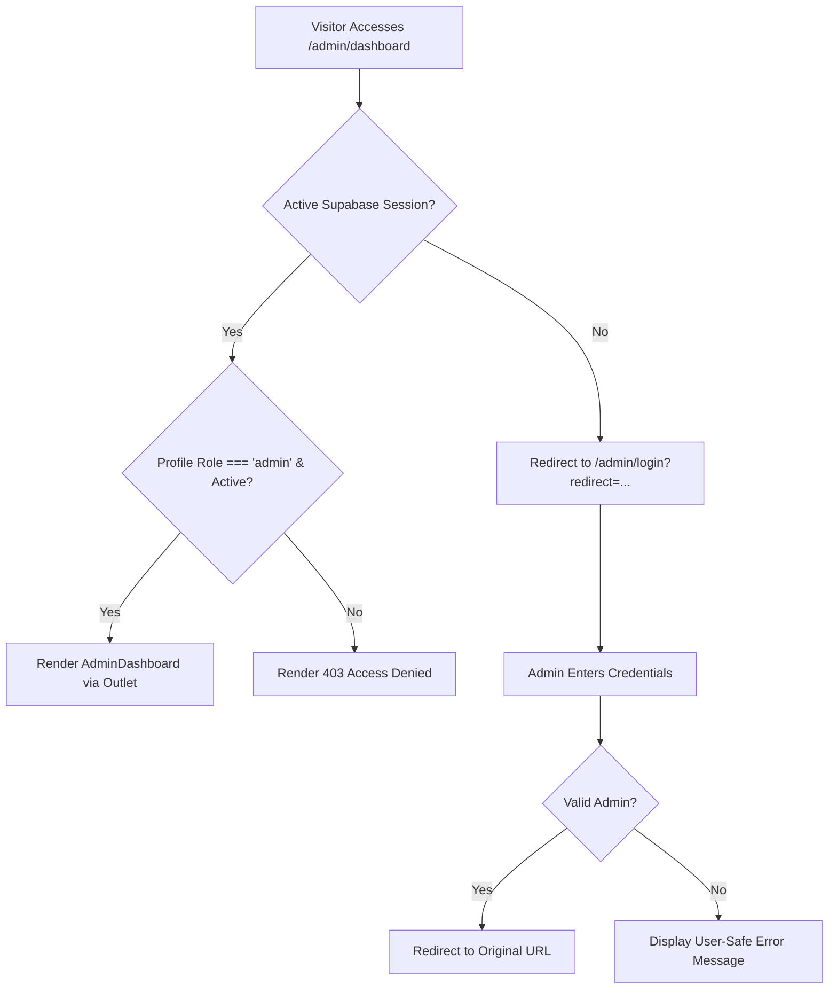

# AKIRA AUTOMATION — Admin Architecture Documentation
## Phase 2: Supabase Authentication + Industrial Admin Dashboard Foundation

---

## 1. Executive Summary

Phase 2 establishes the secure administrative surface for **AKIRA AUTOMATION**, providing an enterprise-grade control portal for precision metrology operations, RFQ management, enquiry monitoring, and product catalogue administration.

Crucially, this phase adheres to three core architectural principles:
1. **Zero Impact on Public Web Traffic**: The public website (`/`, `/products`, `/products/:slug`, `/solutions`, `/contact`, etc.) remains completely untouched, maintaining lightning-fast performance, SEO indexing, and conversion forms.
2. **Industrial Visual Language**: Rather than consumer SaaS aesthetics (generic oranges or gradients), the admin interface embodies AKIRA's engineering precision using deep navy (`#0B1F33`), industrial blue (`#0055A5`), cool steel backgrounds (`#F5F7F9`), crisp white surfaces, JetBrains Mono metric readouts, and restrained 6–12px border radiuses.
3. **Defense-in-Depth Authentication & Security**: Row-Level Security (RLS) enforcement at the PostgreSQL layer is coupled with JWT-based session persistence, role-based client routing, redirect preservation, and automatic session expiration handling.

---

## 2. Directory Structure & File Map

```
src/
├── auth/
│   ├── AuthProvider.tsx         # Supabase auth listener, profile fetching, session lifecycle
│   ├── ProtectedRoute.tsx       # Route guard with 403 Forbidden screen & redirect preservation
│   ├── authService.ts           # signIn, signOut, getProfile, refreshSession methods
│   ├── useAuth.ts               # Custom React hook consuming AuthContext
│   ├── AuthProvider.test.tsx    # Auth state transition tests
│   └── ProtectedRoute.test.tsx  # Guard access & restriction tests
├── components/
│   └── admin/
│       ├── AdminLayout.tsx       # Master 2-column admin layout (aside + top header + main outlet)
│       ├── AdminSidebar.tsx      # Desktop fixed aside & mobile slide-in drawer
│       ├── AdminHeader.tsx       # Top bar with hamburger toggle, search, DB status, profile menu
│       ├── AdminProfileMenu.tsx  # Avatar dropdown with role badge, public website link, sign out
│       ├── AdminStatCard.tsx     # Compact KPI metric card with monospace numbers & trend badges
│       ├── EnquiryTrend.tsx      # 7-day inbound RFQ volume SVG/CSS bar chart
│       ├── EnquiryStatusSummary.tsx # Pipeline stage progress bars (New, Contacted, In Review, Converted)
│       ├── RecentEnquiries.tsx   # Dual-mode desktop table & mobile card stack for inbound RFQs
│       ├── UpcomingFollowups.tsx # Actionable follow-up schedule with contact & type icons
│       ├── RecentActivity.tsx    # Immutable audit trail fed from activity_logs
│       ├── AdminSkeleton.tsx     # High-fidelity pulse placeholders during data queries
│       ├── AdminErrorState.tsx   # Industrial error banner with retry triggers
│       └── AdminLayout.test.tsx  # Mobile drawer accessibility & profile interaction tests
├── pages/
│   └── admin/
│       ├── AdminLogin.tsx        # Engineering portal login with password toggle & session detection
│       ├── AdminDashboard.tsx    # Main operations overview page assembling KPI widgets
│       ├── AdminLogin.test.tsx   # Form validation, session expiry, and redirect tests
│       └── AdminDashboard.test.tsx # Metrics rendering, empty states, and error handling tests
├── services/
│   ├── dashboardService.ts       # Aggregates KPI statistics, 7-day trends, follow-ups, and logs
│   ├── enquiryService.ts         # Inbound enquiry queries, pipeline updates, and filtering
│   ├── followupService.ts        # Scheduled customer touchpoints and reminder tracking
│   ├── productImageService.ts    # Product image catalogue queries and asset associations
│   └── activityLogService.ts     # System and admin action auditing
└── utils/
    └── date.ts                   # Standardized browser-local date, time, and relative formatters
```

---

## 3. Authentication & Route Guard Architecture

### 3.1 Authentication Provider (`AuthProvider.tsx`)
The `AuthProvider` subscribes to Supabase's `onAuthStateChange` event stream, managing the following states:
- `user`: Authenticated Supabase User object containing UUID, email, and metadata.
- `session`: Active JWT session.
- `profile`: Record loaded from `public.profiles` containing `role`, `full_name`, and `active` status.
- `isAdmin`: Computed boolean (`profile?.role === 'admin' && profile?.active === true`).
- `isAuthenticated`: Boolean (`Boolean(user && session)`).
- `isLoading`: Initial boot indicator preventing flash of unauthenticated screens.
- `sessionExpired`: Boolean flag triggered upon `SIGNED_OUT` when previous session was active.



### 3.2 Protected Route Guard (`ProtectedRoute.tsx`)
The guard verifies authentication and authorization before rendering child components or nested `<Outlet />` pages:
1. **Loading State**: Displays an industrial pulse indicator (`PageLoader`) during session resolution to prevent layout shift.
2. **Unauthenticated Access**: Redirects users to `/admin/login?redirect=${currentPath}` to preserve deep link navigation upon login.
3. **Non-Admin Access**: Authenticated users lacking the `admin` role or whose accounts are marked inactive receive a clear **403 Administrator Privileges Required** screen with a button to return to the public website or switch accounts.
4. **Missing Environment**: If `VITE_SUPABASE_URL` is unset, an informative configuration banner guides engineering setup.

---

## 4. Visual Language & Design System

The admin dashboard replaces the orange consumer SaaS styling of generic templates with AKIRA's signature **Precision Industrial** design system:

| Element | Specification | Rationale |
| :--- | :--- | :--- |
| **Primary Navy** | `#0B1F33` (`bg-industrial-dark`) | Reflects heavy machinery, metrology granite stands, and engineering stability. |
| **Accent Blue** | `#0055A5` (`industrial-primary`) | Precision metrology laser lines, active highlights, and primary action buttons. |
| **Background** | `#F5F7F9` (`bg-industrial-bg`) | Cool steel tone reducing eye strain during extended operational monitoring. |
| **Surfaces** | `#FFFFFF` with `border-slate-200` | High-contrast industrial gauge readability; no muddy translucent overlays. |
| **Metrics Typography** | `font-mono` (JetBrains Mono / monospace) | Clean tabular alignment for calibration numbers, part counts, and dates. |
| **Border Radiuses** | `rounded-lg` (8px) to `rounded-xl` (12px) | Functional, understated corners avoiding playful consumer curves. |

---

## 5. Dashboard Data & Analytics Model

The dashboard is populated dynamically by `dashboardService.ts`, which runs parallel queries against Supabase PostgreSQL:

### 5.1 KPI Cards (`AdminStatCard`)
- **Total Products**: Count of registered products in `products`. Shows active vs inactive inventory.
- **Inbound Enquiries**: Total customer RFQs from `enquiries`. Displays a trend badge showing new leads received in the current 7-day cycle.
- **Follow-ups Scheduled**: Pending and open tasks from `followups`. Surfaces an urgent amber badge if overdue items exist.
- **Converted Orders**: Completed RFQs successfully closed into machine deliveries.

### 5.2 7-Day Enquiry Trend (`EnquiryTrend`)
A lightweight, dependency-free SVG/CSS bar chart aggregating real daily counts from `enquiries.created_at`. Each day renders:
- Proportional bar heights calculated against weekly max volume.
- Interactive tooltip displaying exact count and calendar date.
- Monospace weekday tags (`Mon`, `Tue`, `Wed`, etc.).
- Friendly empty state when 0 enquiries are logged in the window.

### 5.3 Pipeline Distribution (`EnquiryStatusSummary`)
Visualizes enquiry lifecycle stages through proportional progress meters:
- **New / RFQ**: Inbound requests awaiting engineer review (`bg-sky-500`).
- **Contacted**: Preliminary customer calls conducted (`bg-blue-500`).
- **In Review**: Engineering tolerance and CAD evaluations (`bg-amber-500`).
- **Quoted**: Commercial and technical proposals submitted (`bg-indigo-500`).
- **Converted**: Purchase orders confirmed (`bg-emerald-500`).
- **Closed**: Completed or declined files (`bg-slate-400`).

### 5.4 Operational Feed & Action Lists
1. **Recent Enquiries (`RecentEnquiries.tsx`)**:
   - Desktop view: High-density data table displaying client name, company, product interest, status badge, and relative timestamp.
   - Mobile view: Compact card stack preventing horizontal overflow on smartphone viewports.
2. **Upcoming Follow-ups (`UpcomingFollowups.tsx`)**:
   - Displays scheduled client calls, site calibration visits, and quote reviews.
   - Shows overdue tags in red/amber and provides quick status actions.
3. **Recent Activity Timeline (`RecentActivity.tsx`)**:
   - Audit trail populated by `activity_logs`. Tracks product edits, image uploads, status updates, and user logins with relative time stamps (e.g. `2 hours ago`).

---

## 6. Mobile & Accessibility Engineering

- **Slide-In Navigation Drawer**: On viewports `< 1024px`, the left sidebar collapses into an accessible slide-in modal drawer (`role="dialog"`).
- **Keyboard Dismissal**: Pressing the `Escape` key immediately dismisses both the mobile navigation drawer and the user profile dropdown.
- **Scroll Lock**: The body scroll is dynamically locked (`overflow-hidden`) while the mobile drawer is open to prevent background scroll interference.
- **Touch Targets**: All interactive buttons, menu items, and toggles strictly respect the `>= 44x44px` touch target accessibility requirement.
- **ARIA Landmark & Labels**: The sidebar navigation (`aria-label="Admin navigation"`), mobile menu toggle (`aria-label="Open navigation sidebar"`), and close button (`aria-label="Close navigation sidebar"`) ensure 100% screen-reader compatibility.

---

## 7. Verification & Production Test Suite

The administrative implementation passed complete automated verification across unit, integration, and architecture boundaries:

```bash
Test Files: 25 passed (25 total)
Tests:      95 passed (95 total)
Type-Check: tsc --noEmit (0 errors)
Build:      vite build (7.32s, zero warnings)
```

### Verified Test Suites:
- `src/pages/admin/AdminLogin.test.tsx` (6 tests) — Form validation, password reveal/hide, session expired banners, redirect behavior.
- `src/pages/admin/AdminDashboard.test.tsx` (4 tests) — Pulse skeleton loading, database error banners, zero-data empty states, real KPI metric rendering.
- `src/components/admin/AdminLayout.test.tsx` (3 tests) — Mobile drawer toggle, Escape key dismiss, profile menu sign-out.
- `src/auth/ProtectedRoute.test.tsx` (3 tests) — Authenticated admin pass-through, non-admin 403 block, unconfigured alert.
- `src/components/common/EnquiryForm.test.tsx` (7 tests) — Inbound inquiry submission, validation, fallback links, email transmission.
- `src/test/integration/userFlows.test.tsx` (4 tests) — Catalogue search, related products routing, inquiry pre-fill modal, 404 recovery.
- `src/test/architecture/importBoundaries.test.ts` (3 tests) — Strict isolation between public frontend components and admin services.
